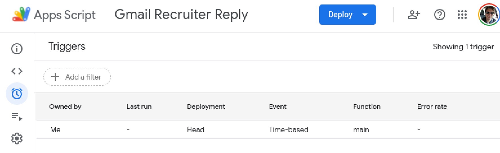

# Gmail Recruiter Reply

This project was born out of me being annoyed of recruiters contacting 
me on my private email which they've got their hands on somehow. 
It's a simple [Google Apps Script](https://developers.google.com/apps-script) 
that I run once on a daily cadence

## Sourcing Firms
If you want to opt out of processing from companies who scrape GitHub and other places on the web for
publicly available information I've started to collect a library of conventient links in [source-firms.md](docs/sourcing-firms.md)

## Description
Current this is the first iteration of this experiment. I've setup 2 labels:
* **RecruitersToMail**
* **RecruitersMailed**

The script runs on a daily cadences, automatically creates a reply draft to any email threads in "RecruitersToMail"
according to the template specified in the script:

```
Hej ${senderName},

Tack för ditt meddelande och för att du visar intresse för mina kompetenser. För närvarande är jag nöjd med min nuvarande arbetssituation och är inte intresserad av att utforska nya möjligheter.

När det gäller hur ni fick tag på min e-postadress, skulle jag vilja veta mer om det. Kan du berätta mer om hur ni hittade mig och min e-postadress? Jag är alltid försiktig med min personliga information och vill säkerställa att mina uppgifter hanteras på ett ansvarsfullt sätt.

Med vänliga hälsningar,
Johan
``` 
It removes the label **RecruitersToMail** and applies **RecruitersMailed** to indicate 
it has processed the email thread

I then manually verify the email and send it when I feel like it. This is currently mostly
to verify the script works as expected before I'm allowing it to run completely automatically without any
verification step by me. Once I'm sufficiently certain it does not have any nasty bugs I'll let it send the mails 
directly instead of just creating drafts removing yet another step.

### How to detect recruiter emails?
I've come up with the following search query which 
seems to capture most recruiter emails in Swedish:
`to:<my-email> profil OR kompetens OR erfarenheter`
however there are false positives so looking into automating this step somehow in the future.

## Setup
1. Setup 2 labels in Gmail, I use "RecruitersToEmail" and "RecruitersEmailed" 

2. Create Google Apps Script
3. Paste code from [main.js](src/main.js) into script
4. Modify labels in the script to the once you setup in Gmail in step 1:
   * `LABEL_TO_MAIL='recruiterstomail'` is the label the script grabs emails from to reply to.
   * `LABEL_MAILED='recruitersmailed'` is the label the script applies after a draft has been created.
5. Find some recruiter email in Gmail and put the label you picked for `LABEL_TO_MAIL` 
6. Run the script manually once to verify draft email is created as expected from the Script editor:
   * **Make sure to pick** `main` **as the function to run!**
   * 
7. Verify draft email has been created with correct label (LABEL_MAILED)
8. Setup automatic trigger on some cadence in triggers UI:
   * 
   * 
9. Done! All you need to do now is put the label (LABEL_TO_MAIL) 
on emails and drafts will be created automatically on the decided cadence.
